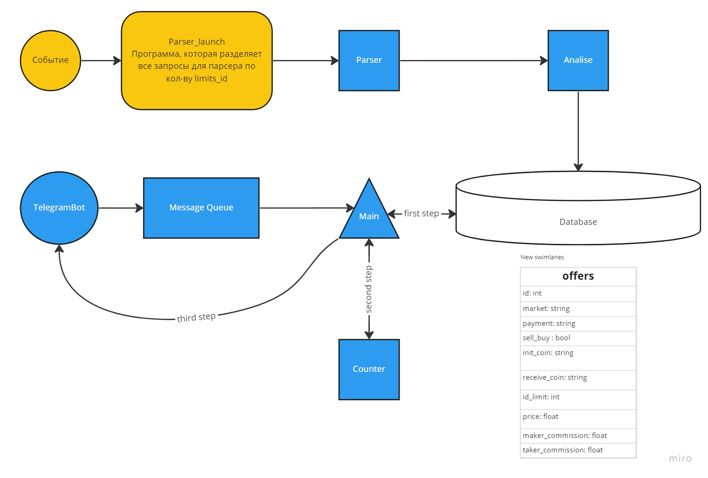

# 💰₿🤑 TELEGRAM-BOT P2P-CRYPTOSCANER 🤑₿💰
Наш проект был вдохновлен современными веяниями в криптовалютном мире, а конкретно нам стало интересно реализовать проект на стыке двух направлений, которые задают тренды в сегодняшнем мире, а именно: **IT и Финансы**. В итоге обсуждения с командой, мы пришли к выводу написать **сканер P2P оферов для криптобирж Binance, ByBit, Huobi**. Да, наш проект не новый, аналоги на рынке уже есть, но мы пытались придумать новый подход к анализу офферов P2P, основанный на теории графов. Ниже мы расскажем, что конкретно было реализовано.

## Немного теории ##

 - **Арбитражная торговля** — вид трейдинга, при котором трейдер пытается извлекать прибыль без рыночных рисков. Ключевая идея арбитража заключается в неэффективном ценообразовании того или иного инструмента или группы инструментов — то есть, рынок неправильно оценивает стоимость актива, что создает арбитражную возможность.

 - **Торговля peer-to-peer** (P2P) — это прямая торговля пользователей друг с другом без участия биржи в качестве посредника.
 
 Почему именно данны эти два определния? На P2P торговле курс выставляют реальные люди, на чьих ошибках легче заработать, в отличие от торговли по офферам биржи, где местные алгоритмы тщательно контролируют отсуствия возможных "вилок". 

## Возможности бота ##

В нашем боте можно выбрать валюту в которой хочет торговать клиент(пока доступен для выбора только деревянный Рубль), банк, где клиент хранит фиат, и биржи, на которых он хочет торговать. К тому же, пользователю доступна вкладка "Help", где он может получить полную справку о взаимодействии с ботом. 

### TODO ДОБАВЬТЕ СКРИНЫ С БОТОМ В ТЕЛЕГЕ

 ## Архитектура проекта

 
 ### [Ссылочка на Миро](https://miro.com/welcomeonboard/alhIbzNzenczSWRSbWEyanQyaTM3dzNjMGZDcUcxTEpUMVZnTnRmYkJ5Mm1odEJuRGkySlNyWDM5ckRjS2NaQXwzNDU4NzY0NTQwMzE4MTk5MjM5fDI=?share_link_id=314551230452)
 Так выглядит архитектура нашего проекта. Выделены две части: **клиент/бекенд и парсер**, реализованный на отдельном сервере, позволяющий нам запускать многопоточную запись в нашу базу данных.
 
 ### Про парсер
Зачем нам нужен отдельный сервер, позволяющий запускать многопоточку? Нам нужно одновременно обрабатывать ситуацию на рынке для разных уровней заработка наших потенциальных пользователей, а на P2P торговле чем больше ты можешь отдать денег, тем лучше курс. Если мы будем последовательно для каждого уровня дохода обрабатывать ситуацию на рынке, то высок риск показывать пользователю неакутальные данные. Парсер запускается по событиям, сейчас это интервал в 30 минут, но мы планируем улучшить логику этой части проекта(см. п. Точки роста). Но почему не сделать всё на одном сервере? Сервер, на котором мы размещаем клиент/бекенд, обходится нам бесплатно, но там нам доступен всего лишь один поток процессора, поэтому было принято решение разделить эти две части проекта на разные хосты. К тому же, такому разделению присуще все плюсы микросервесной архитектуры. Стоит не забыть сказать, о том как мы преобразуем *"сырые"* данные с сайтов в нашу БД. Нами реализован способ ETL (extraction, transformation and loading). В файле *analyse.py* мы отбрасываем ненужные данные, т.е все очевидно невыгодные предложения. После анализа, все данные мы загружаем в БД.

### Про клиент/бекенд
Клиентская часть у нас представлена в виде бота в телеграме, который отдает все запросы пользователя в брокер сообщений RabbitMQ, позволяюищй нам оптимально обрабатывать клиентские запросы. Далее в файле *main.py* мы считываем данные из БД и отправляем их в файл *counter.py*, где мы генерируем ответ для пользователя. Как конкретно реализован алгоритм поиска лучших связок будет рассказано ниже. 
####  TODO расскажите про ребит здесь подрбонее

## Алгоритм поиска лучших связок

Алгоритм реализован с помощью поиска наидленнейшего пути в ациклическом графе. Приведу цитату из Википедии, где хорошо и подробно рассказана реализация алгоритма

> Самый длинный путь A между двумя заданными вершинами s и t во взвешенном графе G — это то же самое, что и кратчайший путь в графе −G, полученном из G путём замены всех весов на веса с обратным знаком. Таким образом, если кратчайший путь можно найти в −G, то можно найти и самый длинный путь в G.

>Для большинства графов такое преобразование бесполезно, поскольку создаёт циклы отрицательной длины в −G. Но если G является ориентированным ациклическим графом, невозможно создать отрицательный цикл и самый длинный путь в G может быть найден за линейное время, применив алгоритм поиска кратчайшего пути в −G (тоже ориентированный ациклический граф), который работает за линейное время. Например, для любой вершины v в ориентированном ациклическом графе длина самого длинного пути, заканчивающегося в v, может быть получена выполнением следующих шагов:

> Осуществляем топологическую сортировку заданного ориентированного ациклического графа (ОАГ).
Для каждой вершины v ОАГ в топологической сортировке вычисляем длину самого длинного пути, завершающегося в вершине v путём просмотра входящих дуг от соседей и добавления единички к максимальной длине в записях этих соседей. Если v не имеет входящих дуг, присваиваем длину самого длинного пути, кончающегося в v, нулю.
Когда это будет сделано, самый длинный путь во всём графе можно получить, начав с вершины v с самым большим записанным значением и проходя в обратном порядке, выбирая входящую дугу, у которой запись в начальной вершине имеет наибольшее значение.

Множеством вершин у нас будут пары типа "Монета-Биржа"(для крипты) и "Фиат-начало/конец", множеством ребер у нас будут предложения P2P торговцев и связи между одинаковыми монетами на разных биржах. В дальнейшем мы планируем создать связи в нашем графе между разными монетами. 

Граф мы не будем явно траспонировать, а сразу задавать связи с учетом "переворота" ребер.

Переходы в ДП будут реализованы так: при оффере типа "Фиат" -> "Крипта", то мы будем искать наименьший курс, т.е, например, мы за 1 рубль купили наибольшее кол-во крипты(курс везде указан в рублях), при  "Крипта" -> "Фиат" будем искать максимальную разницу между балансами вершин, при "Крипта" -> "Крипта" из баланса просто будем вычитать коммиссию за перевод. 

Счет ДП мы запустим с помощью поиска в глубину, запустив его из вершины "Фиат-Конец". Отсуствие цикличности реализуется тем, что мы не можем пройти больше двух раз по ребрам, соединяющие криптомонеты. 

Будем хранить массив предков для каждой вершины, чтобы можно было получить ответ рекурсивно из последней монеты. 

## Точки для роста
Наш сервис далеко не идеален, но мы хотим его улучшать и знаем, что из него может выйти хороший продукт. Вот, что мы в дальнейшем хотим улучшить:

- Улучшение алгоритма подсчета связок, а именно лучше учитывать коммиссию между переводами биткоина, лучше анализировать риск при торговле будучи "Maker"

- Улучшить логику событий для обновления БД. Может быть не совсем обязательно так часто нагружать БД. Например, можно апдейтить, когда мы по менее объемным факторам можем определить, что на рынке меняется ситуация.

- Добавить локализацию на английский, арабский.

- Добавить возможность торговать с долларом, фунтом, юанью, евро.